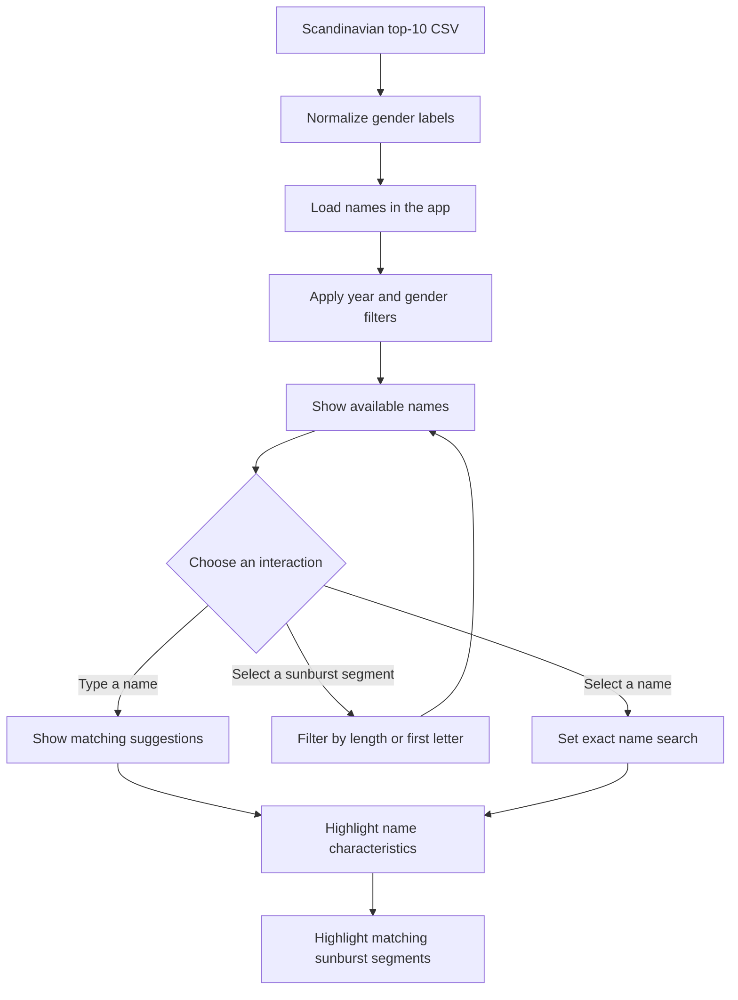

# Scandinavian Baby Names

An information visualization project for exploring popular baby names in Denmark, Norway, and Sweden from 2000 to 2022. The dataset contains top-10 records sourced from SSB, Statistics Denmark, and SCB.

## Requirements

- Node.js and npm

## Run locally

1. Open a terminal in the project directory.
2. Install the dependencies:

	```sh
	npm install
	```

3. Start the development server:

	```sh
	npm run dev
	```

4. Open the local URL printed in the terminal, usually `http://localhost:5173/`.

## Other commands

Create a production build:

```sh
npm run build
```

Preview the production build locally after building:

```sh
npm run preview
```

## Using the visualization

- Search for a name to highlight it and its name-length and first-letter segments in the sunburst.
- Choose a name from the search suggestions or the names list for an exact selection.
- Adjust the year interval or gender to filter the available data.
- Select a length or first-letter segment in the sunburst to narrow the names list.
- Use **Clear** to clear the sunburst selection.

The CSV dataset is located at `public/scandinavia_top10_babynames_2000_2022.csv` and is loaded by the app at runtime.

## Project flow


