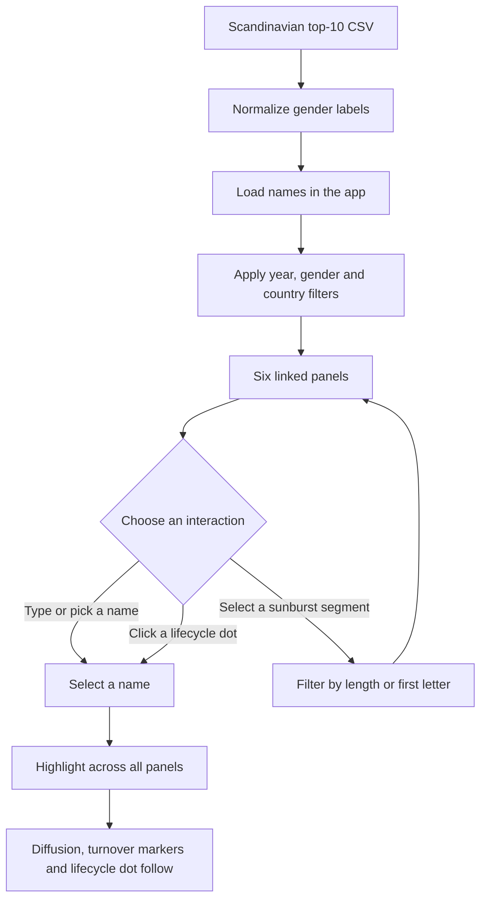

# Scandinavian Baby Names

An information visualization project for exploring popular baby names in Denmark, Norway, and Sweden from 2000 to 2022. The dataset contains top-10 records sourced from SSB, Statistics Denmark, and SCB.

## Run locally (no build or installation of project dependencies)

The frontend uses plain HTML, CSS, and JavaScript, plus **D3.js 7.9.0**, the library
permitted by CP4. There is no Node.js, npm, framework, transpiler, or build step.
D3, the dataset, and all other runtime assets are included locally, so the prototype
works without an internet connection when served by a local static server.

### VS Code Live Server

1. Open this project folder in VS Code with the **Live Server** extension installed.
2. Right-click `index.html` and choose **Open with Live Server**.

### Python alternative

From the project directory, run:

```sh
python3 -m http.server 8000 --bind 127.0.0.1
```

Open `http://127.0.0.1:8000/`. Stop the server with Ctrl+C.
Use a local server rather than opening `index.html` via `file://`, because browser
JavaScript modules and CSV loading require HTTP.

### Included library and submission

- `src/vendor/d3.v7.9.0.min.js` is the complete local D3 distribution.
- `src/vendor/D3-LICENSE.txt` contains its license; include it with the code.
- `src/d3.js` exposes that distribution to the app's native JavaScript modules.
- Include `index.html`, `src/`, and `public/` together when packaging the prototype.
  The CSV in `public/` must accompany the code. No internet downloads are needed.
- To check offline operation, disconnect from the internet, leave the local server
  running, reload the page, and try the charts and filters.

## Using the visualization

The dashboard is six linked panels sharing one set of filters. Selecting a name in
any panel updates all of them.

### Filters

- **Name search** — type to highlight matching names, or pick one from the suggestions.
- **Year interval** — the two-handle slider sets the period every panel reports on.
- **Gender** and **Country** — narrow the dataset; `All` is the default for both.
- **Reset all** — clears the selection and returns the year, gender and country filters
  to their defaults.

### Panels

- **Naming turnover** — the share of each year's top 10 that was not there the year
  before, one line per country. Starts at 2001, since 2000 has no previous year to
  compare against. With a name selected, a dot marks each year it joined or left a
  country's top 10, placed at that year's churn level.
- **Name characteristics** — a sunburst of the available names, grouped by name length
  (inner ring) then first letter (outer ring). Select a segment to narrow the names
  list; the chosen group expands outward and reveals its letters. Click the middle to
  clear the sunburst's own selection.
- **Cross-country diffusion** — for the selected name, the years it held a place in
  each country's top 10, with its peak rank marked.
- **Rank trajectories** — ranks over time, with views for the top 10 and cross-country comparisons.
- **Peak against longevity** — best rank against years in the top 10, with name and density views.
- **Name lifecycle landscape** — one dot per name and country, plotting how fast a name
  rose (years from entry to peak) against how long it lasted (years in the top 10).
  Scroll to zoom, drag to pan, double-click to reset. Click a dot to select that name.

The two left-hand panels share an x-axis scale, so a given year sits at the same
position in both and they can be read together.

The CSV dataset is located at `public/scandinavia_top10_babynames_2000_2022.csv` and is loaded by the app at runtime.

## A note on the data

The source lists are top 10 per country, per sex, per year, so with `Gender: All` each
country contributes 20 names a year. A handful of Swedish years have 21, because SCB
reports ties at rank 10 rather than breaking them.

Lifecycle figures are bounded by the selected period: a name already listed when the
period opens, or still listed when it closes, has no observable entry or exit, so its
rise and longevity are minimums rather than exact values.

## Project flow


